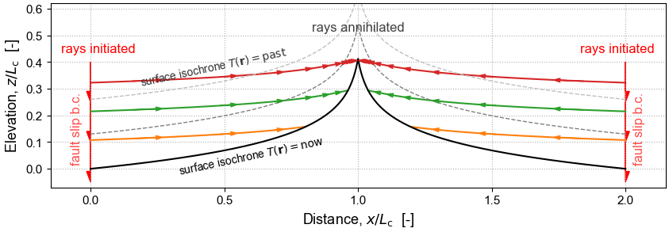

------------------------------------------------------------
The Geometric Mechanics of Erosion (GME)
------------------------------------------------------------

*Exploring how landscapes evolve using the tools of classical mechanics and differential geometry*

The goal of the GME project is to develop geometric mechanics software
tailored to the study erosional processes,
and to make this platform-independent software freely available.

.. image:: https://zenodo.org/badge/386205725.svg
   :target: https://zenodo.org/badge/latestdoi/386205725

These pages provide support for the `GitHub repository of the GME project`_.
The repository provides access to the `gme`_ Python package and `related Jupyter notebooks`_.
A `companion repository`_ provides access to the related `geomorphysics`_ Python library,
called `gmplib`_, which is required by `gme`_.

Contents
--------------------------------

.. toctree::
  :maxdepth: 1

    Presentations <../modules/Presentations>
    Publications <../modules/Publications>
    
    Software design <../modules/Design>
    Dependencies <../modules/Dependencies>
    Installation and set-up<../modules/Installation>
    Running the notebooks <../modules/Running>
    Python package docs <../modules/Python>
    Notebook docs <../modules/Notebooks>

.. _GitHub repository of the GME project: https://github.com/cstarkjp/GME
.. _gme: https://github.com/cstarkjp/GME/tree/master/Packages/gme
.. _related Jupyter notebooks: https://github.com/cstarkjp/GME/tree/main/Notebooks
.. _companion repository: https://github.com/cstarkjp/GMPLib
.. _geomorphysics: https://cstarkjp.github.io/GMPLib/
.. _gmplib: https://github.com/cstarkjp/GMPLib/tree/main/Packages/gmplib

.. References **********
