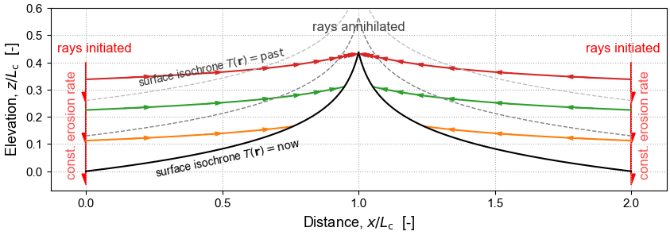
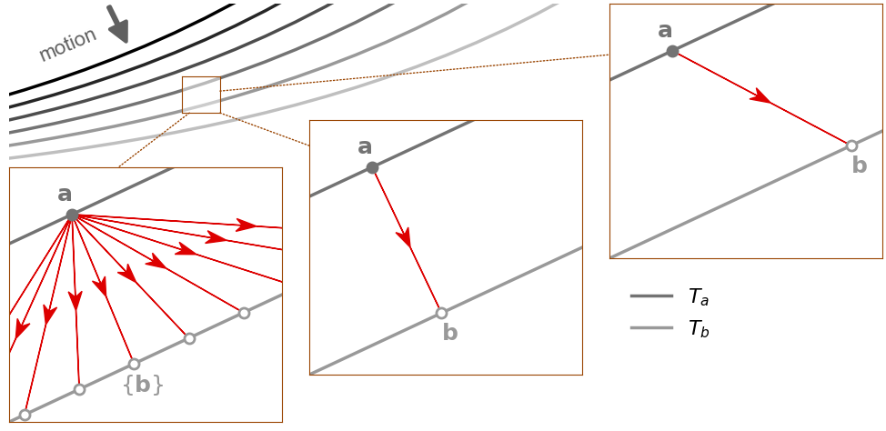
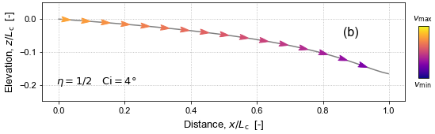
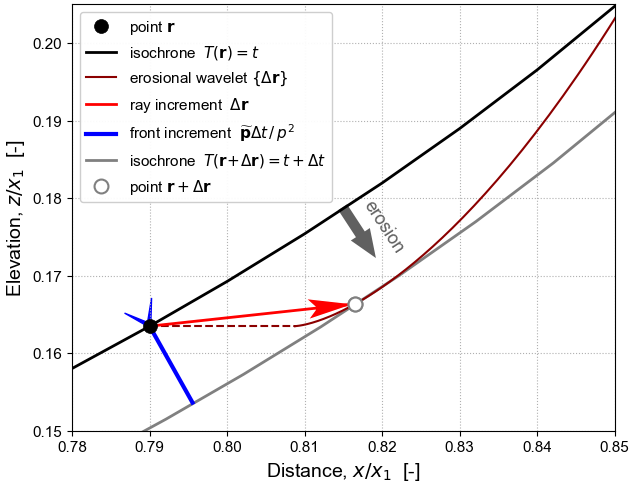
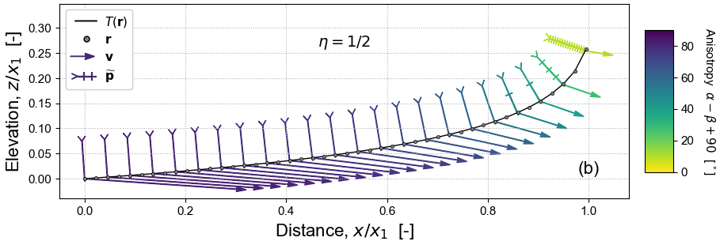

# The Geometric Mechanics of Erosion (GME)

Surface motion driven by geomorphic erosion shares some key features of light propagation in geometric optics and wave propagation in seismology.  Here we adapt methods developed in these fields, in particular their use of classical mechanics and differential geometry, to build a Hamiltonian theory of erosion morphodynamics. This analysis reveals some fundamental properties of landscape evolution, notably: (i) the principle of least "action" that governs the geometry of erosion; (ii) the dynamical system describing its evolution; (iii) its inherent anisotropy; (iv) the two-fold direction of erosion; (v) the way in which information about boundary conditions propagates upstream.

In optics and seismology, wave propagation is associated with a moving wavefront tied to a set of rays tracing the motion of points along it; in geomorphology, the whole landscape is a moving erosion front and the "rays" are trajectories of points tagged on the eroding landscape.

<!--  -->

It is known from classical mechanics that a front *always* moves in its surface-normal direction, but that the corresponding direction of ray motion depends on the anisotropy of the propagation process.
The process of erosion is inherently anisotropic, even if the substrate itself is homogeneous and isotropic, because it is mediated by the component of gravitational acceleration resolved along the surface.
Erosion rate is therefore a function of orientation of the front, and erosional anisotropy is captured by a Finsler metric tensor field. This metric tensor measures the non-Euclidean distance from the front into the substrate, as "seen" by the erosion process, where its yardstick is the time it takes to erode in a given direction.

Since the tensor field is strongly anisotropic, the rays move in a direction sharply different to front motion. The angular disparity satisfies Huygens' principle and can be visualized using an indicatrix, a geometrical construct commonly used in mineralogy, along with its dual (a figuratrix).

In geometric optics and seismology it is well known that rays follow the shortest-time paths, or geodesics, across the metric tensor field. Erosion is therefore controlled by the Fermat variational principle of least erosion time. This is encapsulated in an erosion-front Hamiltonian, which formally defines the dynamical system that determines topographic surface evolution, and in its equivalent Lagrangian. The Hamiltonian is static if external forcing varies over time only at the boundaries and if drainage divides are fixed.

In this context, erosion can be thought of as acting in *two different directions at the same time*: first, the true motion of the front, which is orthogonal to the surface and broadly downwards; second, the "information-carrying" motion, which acts laterally into the substrate and broadly upstream, but with either a positive or negative vertical component set by the gradient dependence of the erosion function.

The erosion-front Hamiltonian reveals a fundamental problem with the concept of landscape steady-state. The term "steady state" describes the stable outcome of a dynamical system. In the dynamical system defined by the Hamiltonian, a point on the topographic surface is set in motion at the boundary and continues to move until it is destroyed at the first drainage divide it encounters, or when overtaken by a faster ray at, for example, a major knickpoint: at no point does it converge in phase space to a stable point or a limit cycle. A time-invariant landscape may arise, but it is the result of an ensemble of successive erosion rays following trajectories of identical shape from a boundary with a constant velocity condition.
